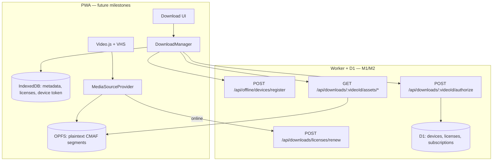

# Offline Downloads — Architecture & Roadmap

Status: **M1 + M2 implemented** (device registration + download API). Client storage, playback, and UI are future milestones.

## Goals

- Premium users download HLS/CMAF renditions for offline viewing inside the PWA.
- Playback stops when subscription or license expires; encrypted files remain on disk.
- Resubscribing renews the license without re-downloading.
- Device registration limits abuse before any DRM investment.

## V1 design decision: Store & License (no segment encryption)

Downloaded CMAF segments are stored **as fetched** in OPFS. Playback is gated by a **signed, time-bounded, device-bound license** — not by per-segment AES-GCM.

Rationale: once bytes reach MSE, a determined attacker can dump them. Segment re-encryption adds CPU/battery cost and service-worker complexity without changing that fact. `KeySessionProvider` and related abstractions are reserved for a future EME/CBCS path.

## Architecture (target state)



## Storage strategy (client — M3+)

| Layer | Technology | Contents |
|---|---|---|
| Blobs | **OPFS** | HLS manifests + CMAF segments (multi-GB safe) |
| Metadata | **IndexedDB** | Download records, licenses, device token, queue |
| App shell | **Cache Storage** | Unchanged — no video media |

Fallback when OPFS unavailable: IndexedDB chunked blobs (4 MB chunks).

## Device registration (M1)

Each registered device receives a long-lived **device token** (independent of the 15-minute access JWT).

| Plan | Max active devices |
|---|---|
| monthly / yearly | 5 (configurable) |
| club | 10 (configurable) |
| staff roles | exempt |

Endpoints:

- `POST /api/offline/devices/register`
- `GET /api/offline/devices`
- `DELETE /api/offline/devices/:deviceId`

## Download API (M2)

Separate from `/api/video-proxy` — no 2-hour `vt` tokens, no segment rate limiting.

| Method | Path | Auth |
|---|---|---|
| `POST` | `/api/downloads/:videoId/authorize` | JWT + device token |
| `GET` | `/api/downloads/:videoId/assets/*` | Download token (`dt` query param) |
| `POST` | `/api/downloads/licenses/renew` | Device token |
| `GET` | `/api/downloads` | JWT |
| `DELETE` | `/api/downloads/:videoId` | JWT |

License `expiresAt = min(subscription.current_period_end, now + offline_max_license_days)`.

Revalidation interval: `offline_revalidation_days` (default 7).

## Subscription revocation

On `customer.subscription.deleted` and `invoice.payment_failed`, the server marks related licenses `revoked`. Client keeps OPFS files; playback blocked until renew after resubscribe.

## Abstraction layers (DRM-ready)

```typescript
interface MediaSourceProvider {
  getPlaylistUrl(videoId: string): Promise<MediaSourceResult | null>
}

interface LicenseProvider {
  authorize(videoId: string, rendition: RenditionKey): Promise<OfflineLicense>
  renew(licenseIds: string[]): Promise<RenewResult[]>
}

interface KeySessionProvider {
  // V1: no-op (plaintext segments)
  // V2: EME / Widevine / CBCS
  getSegmentDecryptionKey?(license: OfflineLicense): Promise<CryptoKey>
}
```

## Implementation milestones

| Milestone | Scope | Status |
|---|---|---|
| **M1** | D1 schema, device registration API | **Done (PR 1)** |
| **M2** | Download authorize, asset delivery, license renew | **Done (PR 1)** |
| M3 | Client OPFS storage + download manager | Pending |
| M4 | License gate + `MediaSourceProvider` playback | Pending |
| M5 | Downloads UI + startup revalidation | Pending |
| M6 | Manifest versioning, quota UI, analytics | Pending |

## Future enhancements (not V1)

- Per-segment encryption + SW decrypt path (only if threat model demands it)
- Source MP4 archival in R2 (`videos/{id}/source.mp4`) — pipeline change
- Subtitle sidecar downloads
- Widevine / EME via `KeySessionProvider` swap
- Per-user forensic watermarking

## Security (realistic V1)

| Prevented | Not prevented |
|---|---|
| Download without subscription | DevTools / MSE buffer dump |
| Playback after cancel (on revalidation) | Same-device OPFS copy |
| Unlimited device sharing | Screen recording |
| Bulk scrape via streaming proxy | |

## Configuration (`admin_settings`)

- `offline_max_license_days` — default `30`
- `offline_revalidation_days` — default `7`
- `offline_device_limit_default` — default `5`
- `offline_device_limit_club` — default `10`

## Related code

- `packages/api/src/offlineDownloads.ts` — handlers
- `packages/api/src/downloadTokens.ts` — download-scoped asset tokens
- `packages/api/src/offlineManifest.ts` — HLS manifest builder
- `packages/api/migrations/0037_offline_downloads.sql` — schema
- `packages/shared/src/index.ts` — shared types
