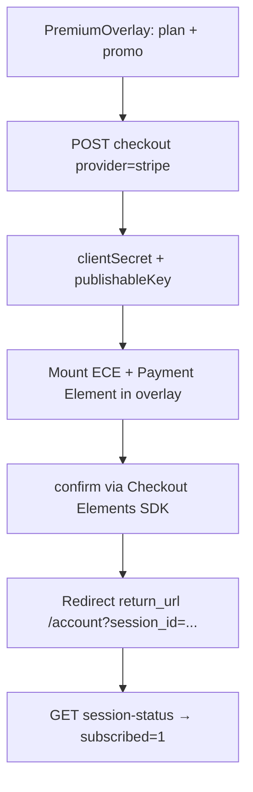

# Stripe Express Checkout (Apple Pay / Google Pay) — Investigation

**Status:** Investigation only (no implementation in this PR).  
**Date:** 2026-05-29  
**Context:** Add a wallet option beside card payments in the premium checkout UI, using Stripe’s [Express Checkout Element](https://docs.stripe.com/elements/express-checkout-element).

---

## Executive summary

| Question | Answer |
|----------|--------|
| Is it feasible? | **Yes**, but not as a small add-on to the current redirect flow. |
| Can we show “Apple Pay on Apple, Google Pay elsewhere” with our own UA logic? | **Not recommended.** Stripe’s element picks eligible wallets per device/browser/region. |
| Minimum change to get wallets in the overlay? | Move **Stripe** checkout from **hosted redirect** to **Checkout Sessions + `ui_mode: "elements"`** and mount Express Checkout (and optionally Payment Element for card) in `PremiumOverlay.vue`. |
| Do webhooks / subscriptions break? | **No** — same `checkout.session.completed` path if sessions stay `mode: subscription`. |

**Recommendation:** Plan a dedicated implementation step: embedded Stripe checkout in the overlay (Express Checkout + card). Register payment method domains in Stripe Dashboard before QA.

---

## Current architecture

### Checkout UI

`packages/web/components/PremiumOverlay.vue` loads pricing from `GET /api/account/pricing`, then renders Stripe embedded checkout (card, PayPal, SEPA debit via Payment Element / Express Checkout).

### Stripe backend

`handleCheckout` in `packages/api/src/paymentProcessor.ts` creates an embedded Checkout Session with `ui_mode: 'elements'` and returns `clientSecret` to the client.

### Frontend Stripe.js

`@stripe/stripe-js` and `@stripe/react-stripe-js` are used in `@vmp/web`. Publishable key is exposed via `GET /api/payments/stripe-config`.

---

## What Express Checkout Element requires

Per [Stripe’s docs](https://docs.stripe.com/elements/express-checkout-element) and the [Checkout Sessions + Elements quickstart](https://docs.stripe.com/payments/quickstart-checkout-sessions):

1. **Client:** `loadStripe(publishableKey)` and mount `expressCheckout` (or `ExpressCheckoutElement` with `@stripe/react-stripe-js/checkout` + `CheckoutElementsProvider`).
2. **Server:** Create Checkout Session with `ui_mode: "elements"`, `mode: "subscription"`, `return_url` (not `success_url` / `cancel_url`), return **`client_secret`** to the client.
3. **Confirm:** User completes wallet flow in-page; Stripe redirects to `return_url` with `{CHECKOUT_SESSION_ID}`.
4. **Return page:** Poll or retrieve session status (`complete` vs `open`) — extend `account.vue` or handle in overlay return flow.

Express Checkout also supports Link, PayPal, etc. Use `paymentMethods: { applePay: 'never' | 'always', googlePay: … }` only to tune visibility, not to replace Stripe’s platform detection.

### “Dynamic Apple Pay vs Google Pay”

**Do not** implement `navigator.userAgent` switching:

- Apple Pay on desktop Chromium only appears on **macOS** with specific options (`paymentMethods.applePay: 'always'` still won’t force unsupported platforms).
- Google Pay may be hidden if **Link** is logged in (see Stripe wallet testing docs).
- Firefox: no Apple Pay; Google Pay only in some setups.

**Do** listen to `availablepaymentmethodschange` and only show a “Wallet” row/tab when `paymentMethods` is non-empty. Hide the row otherwise (or fall back to card).

---

## Integration options (compared)

### Option A — Wallet tab only (hybrid)

| | |
|---|---|
| **UX** | Tabs: Wallet \| Card. Wallet mounts ECE; Card still redirects to hosted Checkout. |
| **Pros** | Smaller change to card path; wallet in overlay. |
| **Cons** | Two Stripe integrations to maintain; promo/plan changes must work in both paths; worse UX consistency. |
| **Effort** | Medium |

### Option B — Embedded Stripe for card + wallet (recommended)

| | |
|---|---|
| **UX** | Tabs or sections: **Wallet** (ECE) + **Card** (Payment Element). Single Stripe session per attempt. |
| **Pros** | Aligns with Stripe guidance; one session; wallets + cards share promo/discounts; stays in overlay/modal. |
| **Cons** | Larger frontend change; must handle `return_url` and session status; CSP/script allowlist for `js.stripe.com`. |
| **Effort** | Medium–high |

### Option C — Keep redirect only

| | |
|---|---|
| **UX** | No overlay wallet; rely on Stripe hosted page. |
| **Pros** | Zero code. |
| **Cons** | Does not meet product ask. |
| **Effort** | None |

---

## Proposed target design (Option B)

### API changes (sketch)

1. **`POST /api/payments/checkout`**
   - Body: `{ planType, provider, promoCode, uiMode?: 'hosted' | 'elements' }` (default `elements`).
   - For `provider === 'stripe'`:
     - `ui_mode: 'elements'`
     - `return_url: ${FRONTEND_URL}/account?session_id={CHECKOUT_SESSION_ID}`
     - Response: `{ clientSecret, provider }`.

2. **`GET /api/payments/session-status?session_id=cs_...`** (auth required)
   - Retrieve session; return `{ status, payment_status, subscription_id }` for return page.

3. **Publishable key**
   - `GET /api/payments/stripe-config` → `{ publishableKey }` from `env.STRIPE_PUBLISHABLE_KEY`.

### Frontend changes (sketch)

1. Add `@stripe/stripe-js` and `@stripe/react-stripe-js` to `@vmp/web`.
2. Client-only plugin or lazy import in `PremiumOverlay` (avoid SSR loading Stripe.js).
3. Payment method UI: Wallet + Card panels after `clientSecret` is fetched (re-fetch when plan/promo changes).
4. `buttonType: { applePay: 'subscribe', googlePay: 'subscribe' }` for subscription copy.
5. On `availablepaymentmethodschange` with no methods → hide Wallet tab and default to Card.

### Unchanged

- Webhook handler `checkout.session.completed` and metadata (`userId`, `planType`, promo fields).
- Admin price IDs (`stripe_price_*`) and promo coupon mapping.
- Optional legacy provider for grandfathered subscriptions (separate from Stripe checkout).

---

## Dashboard & environment checklist

Before QA on staging/production:

| Item | Action |
|------|--------|
| [Payment method domains](https://dashboard.stripe.com/settings/payment_method_domains) | Register `vmp.tjm.sk`, API host if different, and `localhost` for dev |
| [Payment methods](https://dashboard.stripe.com/settings/payment_methods) | Enable Apple Pay, Google Pay (and Link if desired) |
| Wallet testing | Follow [Stripe wallet testing](https://docs.stripe.com/testing/wallets) (non-incognito, regional IP, saved cards, Safari “Allow websites to check for Apple Pay”) |
| India | Stripe hides wallets for India IP / India-based accounts |
| PWA / WebView | Limited wallet support; test in Safari/Chrome native browsers |

---

## Risks & edge cases

1. **Plan/promo changes after session created** — Remount Elements or create a new Checkout Session when `selectedPlan` or applied promo changes.
2. **Active subscription guard** — Already returns 409; still applies before creating a session.
3. **Cloudflare Pages + iframes** — Elements use Stripe iframes; ensure no restrictive CSP blocks `https://js.stripe.com` and Stripe frame origins.
4. **Link vs Google Pay** — Users with Link may see Link instead of Google Pay in demos; not a bug.

---

## Effort breakdown (implementation step, not calendar)

| Area | Work |
|------|------|
| API: elements session + session-status + publishable config | Small–medium |
| Web: dependencies, overlay UX, Elements lifecycle | Medium |
| Account return handling | Small |
| Dashboard domain registration | Ops (no code) |
| Manual QA matrix (Safari/macOS, iOS, Chrome Android/desktop) | Medium |

---

## References

- [Express Checkout Element](https://docs.stripe.com/elements/express-checkout-element)
- [Checkout Sessions + Elements quickstart](https://docs.stripe.com/payments/quickstart-checkout-sessions)
- [Testing Apple Pay and Google Pay](https://docs.stripe.com/testing/wallets)
- [Payment method domain registration](https://docs.stripe.com/payments/payment-methods/pmd-registration)
