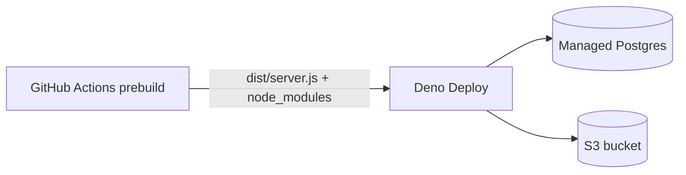

# @vmp/api-node — VMP API on Deno Deploy

HTTP server that runs the **same** `@vmp/api` Worker handlers with adapter bindings for:

- **D1** → managed **PostgreSQL** via `DATABASE_URL` (Deno Deploy injects per context: local / preview / production)
- **R2** → S3-compatible bucket (`@aws-sdk/client-s3`)
- **KV** → `kv_store` Postgres table (rate limits)
- **Cache** → in-memory LRU
- **Durable Objects** → in-memory segment rate limiter

Deploy target: [Deno Deploy](https://docs.deno.com/deploy/) with GitHub Actions prebuild (`deploy-api-node-backup` in `.github/workflows/deploy.yml`).

## Contents

- [Architecture](#architecture)
- [Deno Deploy setup](#deno-deploy-setup)
- [CI prebuild (same as local release)](#ci-prebuild-same-as-local-release)
- [Local development](#local-development)
- [D1 → Postgres replication (Cloudflare Queues)](#d1--postgres-replication-cloudflare-queues)
- [Optional admin write log](#optional-admin-write-log)
- [Legacy VM / Fly.io paths](#legacy-vm--flyio-paths)
- [Related documentation](#related-documentation)

## Architecture



The Worker `fetch()` entry in `packages/api/src/index.ts` is invoked unchanged. `packages/api-node` only adds runtime shims.

**Why Postgres, not SQLite:** Deno Deploy cannot load native Node addons (`better-sqlite3` `.node` bindings). The D1 API surface is emulated in `src/bindings/db.ts` with `postgres` (pure JS) and a SQLite→PostgreSQL SQL dialect layer (`src/bindings/sqlDialect.ts`).

## Deno Deploy setup

1. Provision **Prisma Postgres** (or attach external Postgres) in the [Deno Deploy dashboard](https://console.deno.com) and assign it to the app — `DATABASE_URL` is injected automatically per environment.
2. Set deployment mode to **GitHub Actions** (no install/build in the Deno UI).
3. Repository variables: `DENO_DEPLOY_ORG`, `DENO_DEPLOY_APP`. Secret: `DENO_DEPLOY_TOKEN`.
4. Copy Worker secrets into Deno Deploy env vars (see `.env.example`).
5. `GET /api/health` should return `"mode": "deno-deploy"` and `"checks.database": { "ok": true, "backend": "postgres" }`.

## CI prebuild (same as local release)

From `packages/api-node`:

```bash
node scripts/deploy-install.mjs
npm run build
node scripts/deploy-prune-prod.mjs
test -f dist/server.js
test -d node_modules/postgres
node scripts/deno-deploy-upload.mjs   # needs DENO_DEPLOY_TOKEN
```

**Uploaded tree:** `dist/server.js` (esbuild bundle of `@vmp/api` + adapters) and production `node_modules/` (`postgres`, `@aws-sdk/client-s3`).

## Local development

```bash
cp .env.example .env
# Set DATABASE_URL to a local or tunneled Postgres instance
npm run dev --workspace=@vmp/api-node
```

Migrations from `packages/api/migrations/` are applied at boot (SQLite DDL translated for Postgres). Set `RUN_MIGRATIONS=0` if the schema is managed elsewhere (e.g. Deno pre-deploy migrations).

## D1 → Postgres replication (Cloudflare Queues)

The primary API (Cloudflare Worker) enqueues row changes on **`vmp-replication-events`**. The Worker **`binding`** in `packages/api/wrangler.json` is `vmp_replication_events` — that string is the property on `env` in code (`getReplicationQueue` in `packages/api/src/queueBindings.ts`). The **`queue`** name (`vmp-replication-events`) is only the Cloudflare resource id.

1. On the **Worker**, set secrets:
   - `REPLICATION_TARGET_URL` — e.g. `https://<your-deno-app>/api/internal/replication/ingest`
   - `REPLICATION_TARGET_TOKEN` — shared bearer secret
2. On **Deno Deploy** (api-node), set the same value as `REPLICATION_INGEST_TOKEN` (or `REPLICATION_TARGET_TOKEN`).
3. Cron (`*/5 * * * *`) runs `enqueueReplicationBatch`; the queue consumer POSTs batches to the ingest URL.
4. Admin: `GET/PATCH /api/admin/replication` on the Worker (mode `d1_to_pg`, optional cursor reset).

## Optional admin write log

Mutating SQL can be recorded in `failover_write_log` for audit (`ENABLE_WRITE_LOG`, default on). Inspect via:

- `GET /api/admin/failover/write-log`
- `POST /api/admin/failover/write-log/export`

## Legacy VM / Fly.io paths

`Dockerfile` and `fly.toml` remain for historical VM failover but are not the primary deployment path. They assumed on-disk SQLite; use Deno Deploy + Postgres instead.

## Related documentation

| Document | Description |
| --- | --- |
| [Repository README](../../README.md) | Monorepo overview, local setup, documentation map |
| [AGENTS.md](../../AGENTS.md) | Primary Worker API, D1 schema, secrets, replication queue bindings |
| [DEPLOYMENT.md](../../DEPLOYMENT.md) | CI/CD, env templates, deploy workflow |
| [packages/podcast-host/README.md](../podcast-host/README.md) | Media VM pipeline (primary encode path; separate from api-node) |
