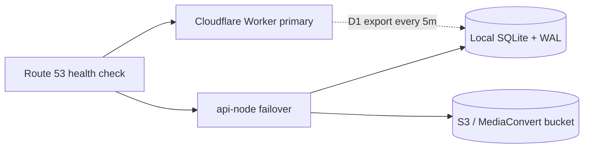

# @vmp/api-node — VMP API failover server

Hot-standby HTTP server that runs the **same** `@vmp/api` Worker handlers on Node.js 22, with adapter bindings for D1 (SQLite), R2 (S3), KV (SQLite table), edge cache (in-memory LRU), and segment rate limits (in-memory).

Deploy to a plain Linux VM (Docker) or [Fly.io](https://fly.io) (`fly.toml` included). Route 53 (or any health-checked DNS) can point `api.example.com` here when Cloudflare Workers is unavailable.

## Architecture



The Worker `fetch()` entry in `packages/api/src/index.ts` is invoked unchanged. Only `packages/api-node` adds runtime shims.

## Cold start procedure

1. Copy `.env.example` to `.env` and fill secrets (match production Worker secrets).
2. **Fly.io:** create the persistent volume once, then deploy from repo root:
   ```bash
   fly volumes create vmp_sqlite_data --region fra --size 1
   fly deploy --config packages/api-node/fly.toml
   ```
3. **Docker on a VM:**
   ```bash
   docker build -f packages/api-node/Dockerfile -t vmp-api-failover .
   docker run --env-file packages/api-node/.env -p 8787:8787 -v vmp-data:/data vmp-api-failover
   ```
4. On first boot, migrations from `packages/api/migrations/` run automatically, then an immediate D1 sync runs (requires `CF_*` vars).
5. Confirm `GET /api/health` returns `"status": "healthy"` or `"degraded"` with populated `checks.database` and `checks.lastD1Sync`.
6. Route 53 health checks against `/api/health` should pass within about two minutes.

## Failover end to end

| Step | Timing |
|------|--------|
| Route 53 polls primary Worker `/api/health` | every 30s |
| 3 consecutive failures | ~90s |
| DNS TTL on `api` record | 60s (+ propagation) |
| **Total** CF outage → traffic on standby | ~3–4 minutes |

The standby pulls a full D1 SQLite snapshot every **5 minutes** (`D1_SYNC_INTERVAL_MS`), so reads are at most ~5 minutes stale unless failover writes occurred locally.

## Write divergence during failover

While Cloudflare is down, writes (registrations, subscriptions, publishes, settings) go to local SQLite. Each mutating SQL statement is also appended to `failover_write_log`.

- Inspect: `GET /api/admin/failover/write-log` (requires `admin` or `super_admin` JWT)
- Export SQL: `POST /api/admin/failover/write-log/export` (same auth) or:
  ```bash
  npm run sync:write-log-export --workspace=@vmp/api-node
  ```

**These writes are not pushed back to Cloudflare D1 automatically.** After recovery, review the export and apply to production D1 manually.

## What does not work (or is degraded) in failover mode

| Feature | Behavior |
|---------|----------|
| Durable Object segment rate limits | In-memory counter; resets on restart |
| Cloudflare edge cache (`caches.default`) | In-memory LRU (~256 entries) |
| Stripe webhooks to Worker URL | Still delivered to CF if partially up; Stripe retries ~3 days if fully down |
| New push subscription rows | May exist only locally until write log is replayed |
| D1 Sessions API (`withSession`) | Uses primary SQLite (no replication lag simulation) |

## Recovery when Cloudflare returns

1. Export and review `failover_write_log` / SQL file; apply to production D1.
2. Let Route 53 fail back when primary `/api/health` succeeds 3 times.
3. Monitor ~30 minutes for split-brain (duplicate emails, double charges).

## Backup deploy (Deno Deploy via GitHub Actions)

Production failover on [Deno Deploy](https://docs.deno.com/deploy/) is **not** built on Deno’s hosted install step (that pulled the monorepo and Nx). It is prebuilt on **Blacksmith** in [`.github/workflows/deploy.yml`](../../.github/workflows/deploy.yml) job `deploy-api-node-backup`, then uploaded with `deno deploy --allow-node-modules`.

**Dashboard:** link the repo in [console.deno.com](https://console.deno.com), org/app `tjm`/`vmp` (override with repo vars `DENO_DEPLOY_ORG` / `DENO_DEPLOY_APP`), and set deployment mode to **GitHub Actions** (no install/build commands in the Deno UI).

**Secret:** `DENO_DEPLOY_TOKEN` from [Access tokens](https://console.deno.com/account/access-tokens).

**What gets uploaded:** `dist/server.js` (esbuild bundle of `@vmp/api` + adapters) and **production** `node_modules/` (`better-sqlite3`, `@aws-sdk/client-s3`). DevDependencies are pruned on the runner before upload.

```bash
# Same steps as CI (from packages/api-node)
node scripts/deploy-install.mjs
npm run build
node scripts/deploy-prune-prod.mjs
# With DENO_DEPLOY_TOKEN set:
node scripts/deno-deploy-upload.mjs
```

## PaaS / VM deploy (non-Deno)

```bash
# Monorepo (local dev)
npm run install:api-node
npm run build:api-node

# Isolated Node host (Fly, Docker, VM)
cd packages/api-node
node scripts/deploy-install.mjs
npm run build
node dist/server.js
```

Set **Node** to `22.12.0`+ or `24.11.0`+ (see `.node-version`). See [`deploy.json`](./deploy.json) for metadata.

## Development

```bash
# From repo root
npm install
cp packages/api-node/.env.example packages/api-node/.env
# Set JWT_SECRET, TOTP_ENCRYPTION_KEY, etc.

npm run build --workspace=@vmp/api-node
SQLITE_DB_PATH=./data/vmp.sqlite npm run start --workspace=@vmp/api-node
```

API handler dev against local Worker data without CF sync: omit `CF_API_TOKEN` (sync logs a warning; use seeded local DB from wrangler migrations instead).

## Manual D1 sync

```bash
npm run sync:now --workspace=@vmp/api-node
```

## Environment variables

See [`.env.example`](./.env.example). Required for production failover:

- `JWT_SECRET`, `TOTP_ENCRYPTION_KEY` (and other secrets matching Worker)
- `S3_BUCKET_NAME` + AWS credentials
- `CF_ACCOUNT_ID`, `CF_API_TOKEN`, `CF_D1_DATABASE_ID` for periodic D1 export

## Build notes

`npm run build` typechecks with `tsc`, then bundles `src/server.ts` and CLIs with **esbuild** so `@vmp/api` TypeScript (`.js` import specifiers) runs under Node without duplicating business logic.
